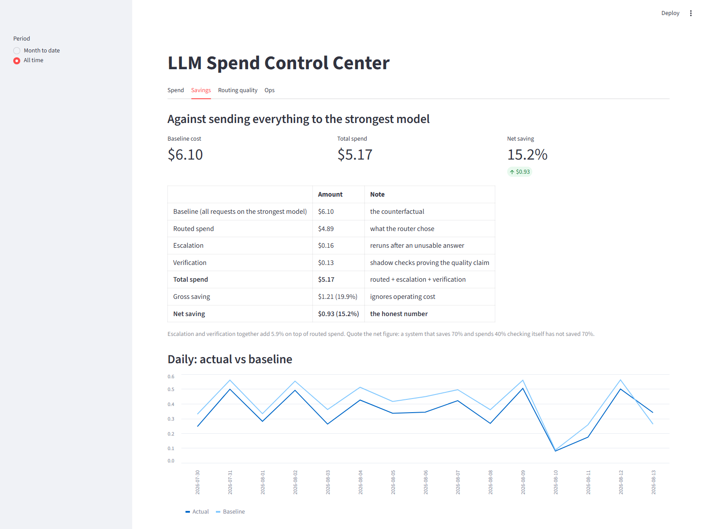
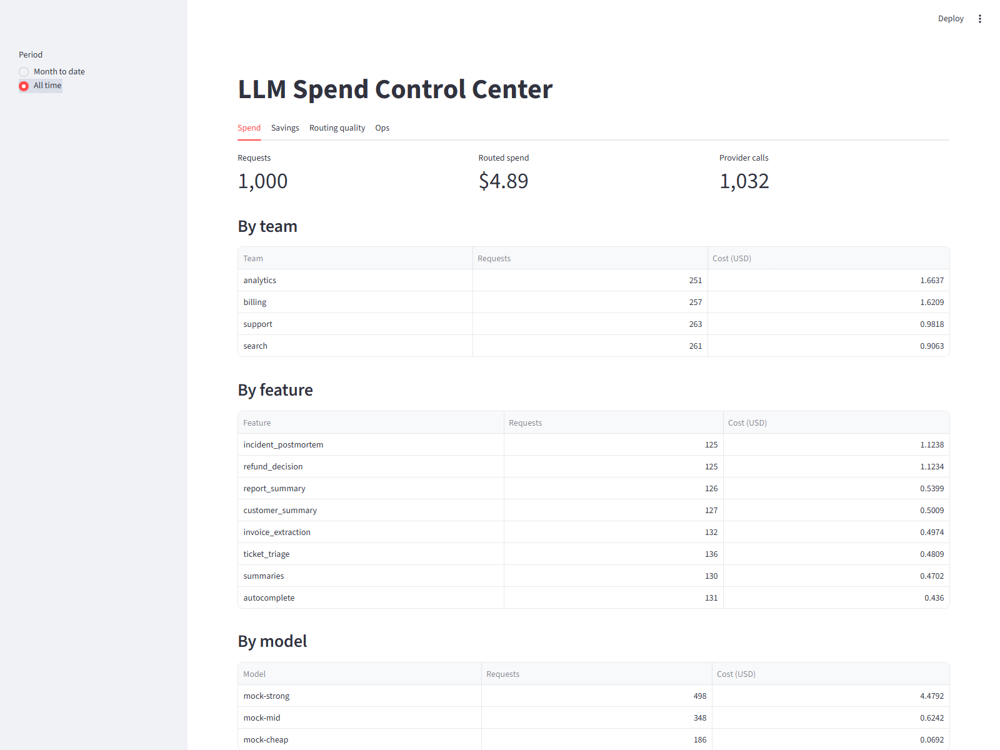
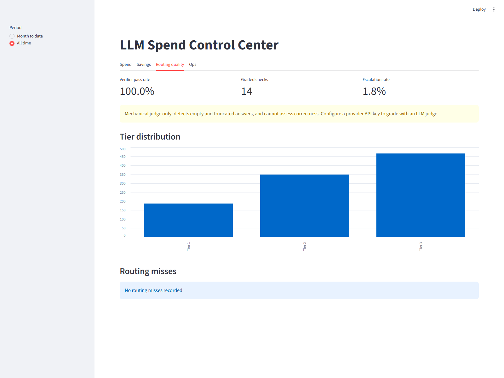
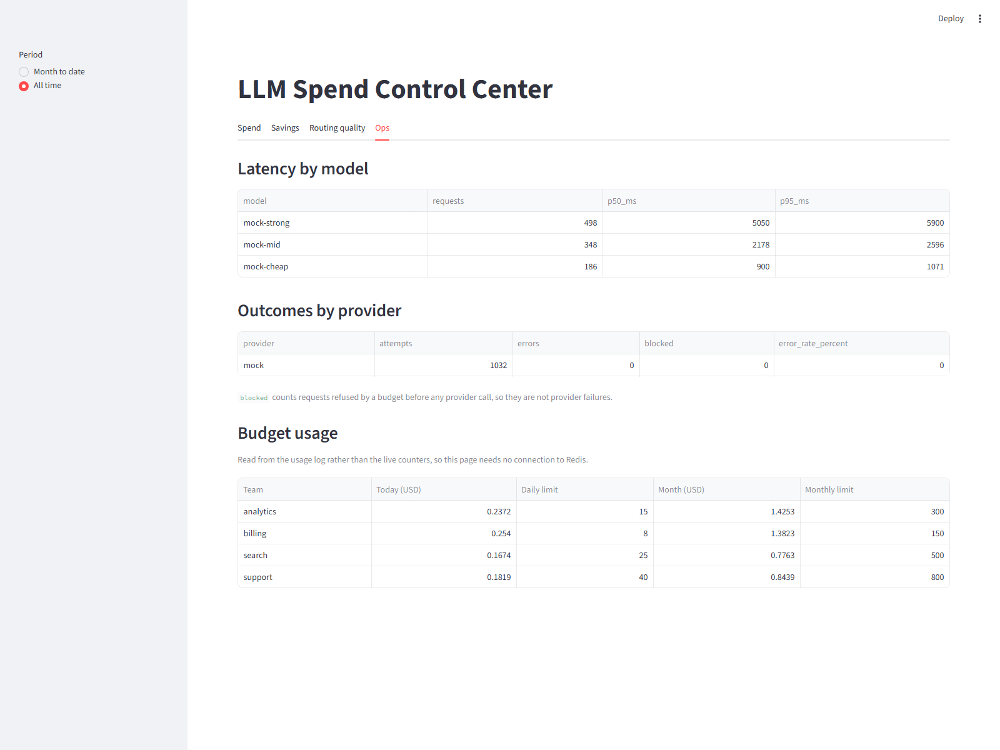

# LLM Spend Control Center

A routing and budgeting layer that sits in front of LLM calls. It tracks spend per
team and feature, routes each request to the cheapest model that can actually
handle it, and blocks requests before the money is spent when a budget runs out.

> **Result:** cut simulated LLM spend by **15.2% net** (19.9% gross) across 1,000
> requests, at a 100% pass rate on 14 mechanically graded quality samples.
>
> That number is lower than it could have been made to look, and
> [the case study](docs/CASE_STUDY.md) explains why: **46.6% of requests need a
> strong model, and they consume 92% of the spend.** The savings ceiling is set by
> the traffic mix, not by how clever the router is.

```bash
pip install -r requirements.txt
python -m scripts.simulate_workload    # 1,000 requests, no API keys, ~30 seconds
streamlit run dashboard/cost_dashboard.py         # then look at the Savings tab
```

## The problem

Teams ship LLM features by pointing everything at the strongest available model. It
works, and the bill grows quietly until someone notices. Two things are missing:
nobody knows who is spending what, and most requests don't need the strongest
model — extracting a date and writing a legal summary get billed at the same rate.

This gateway fixes both, and measures whether the cheaper routing actually held up.

## How a request flows

```
POST /v1/chat
     |
[1] classify      prompt -> complexity tier (1 simple / 2 moderate / 3 hard)
[2] route         tier + feature overrides + risk tags + context limits -> model
[3] estimate      count tokens, price with the model registry
[4] reserve       atomically add the estimate to the day + month counters
     |            -> over budget? reject HERE, before spending anything
[5] call          OpenAI / Anthropic / Ollama / mock
[6] settle        replace the estimate with the real cost, refund the difference
[7] log           one usage row: tokens, latency, cost, and baseline cost
[8] escalate      answer unusable? rerun on a stronger model before replying
[9] verify        sample 2% of cheap answers, grade them offline against a strong model
     v
   { text, chosen_model, tier, cost_usd, baseline_cost_usd, routing_reason, budget_status }
```

**The detail worth pausing on:** budgets are enforced *before* the provider call
using an estimate, but the true cost is only known *after* the response. So the
gateway reserves the estimate, then settles the difference once the real token
counts arrive. A failed call releases its reservation, so an error never silently
eats budget. The reservation **increments first and inspects the result**, because
read-then-write would let two concurrent requests each see room for one — there is
a test that races ten requests at $0.40 against a $1.00 budget and asserts exactly
two get through.

## What it looks like

```console
$ curl -s localhost:8000/v1/chat -H 'content-type: application/json' -d '{
    "messages":[{"role":"user","content":"Extract the invoice number."}],
    "team_id":"search","feature":"summaries"}'

{"chosen_model":"mock-cheap","tier":1,"cost_usd":0.000363,
 "baseline_cost_usd":0.001815,"budget_status":"allow",
 "routing_reason":"classifier: tier 1 (score +0.0): extraction verb"}
```

The same request tagged `feature=refund_decision` goes to the strongest model
instead, and says so:

```json
{"chosen_model":"mock-strong","tier":3,"cost_usd":0.008925,
 "routing_reason":"feature override: 'refund_decision' always uses tier 3"}
```

That is the whole design in two responses: cheap when it can be, strong when
correctness matters, and never silent about which.

## The dashboard

`streamlit run dashboard/cost_dashboard.py` — four tabs, every figure traced back
to a query in `app/reporting.py`. These are real screenshots of the 1,000-request
simulation.

### Savings — the counterfactual, with its own operating cost subtracted



The table is the argument: **gross saving 19.9%, net saving 15.2%.** Escalation and
verification are broken out rather than folded into routed spend, because both cost
real money. A system that saves 70% while spending 40% checking itself has not
saved 70%.

### Spend — who is spending, on what, and where it is heading



Note the model table: `mock-strong` takes 498 of 1,032 provider calls but
**$4.48 of $5.17** — the tier-3 concentration that caps the savings ceiling.

### Routing quality — the pass rate, and what produced it



The pass rate ships with its caveat attached: with no API key the judge is
mechanical, so it detects empty and truncated answers and cannot assess
correctness. The warning is rendered by the app, not written into the README.

### Ops — latency, provider outcomes, budget headroom



Budget-blocked requests are counted separately from provider errors: a request
refused by a budget never reached a provider and should not count against it.

## Design decisions

| Decision | Why |
|---|---|
| Estimate → reserve → settle | The only correct way to enforce a budget when cost is unknown until after the call. |
| Increment-then-verify, not read-then-write | Two concurrent requests must not both pass a check that had room for one. |
| Redis counters, in-memory fallback | Budget checks sit in the hot path and must be atomic across workers. Unset `REDIS_URL` and it still runs. |
| Counters seeded from the usage log on startup | Otherwise every deploy hands each team a fresh budget. |
| Rule-based classifier | It returns the *reasons* for its tier, which a black box cannot. Measured on a holdout, not just a training set. |
| Feature overrides above the classifier | A text-based guess should not be the only thing between a legal question and the cheapest model. |
| `baseline_cost_usd` on every row | Savings are a query over data, not a spreadsheet afterwards. |
| Shadow verification, sampled at 2% | A savings number with no quality number just means "used the cheap model". |
| Escalation and verification logged separately | Both cost real money. Folding them into routed spend would inflate the savings. |
| SQLite default, Postgres via Compose | Clone and run with no setup; production shape one env var away. |

## What the numbers actually say

Three results worth reading before trusting anything here:

- **Classifier: 98.4% on the set its weights were tuned on, 48.5% on a holdout.**
  The gap is the point. A ~50% classifier is not what makes this system safe — the
  overrides, risk-tag floors, and shadow verification are.
- **Verification costs ~25× the tier-1 request it checks.** At the 10% sample rate
  originally planned, measuring the saving would have consumed most of it.
  Sampling is 2%, and the cost is a visible line in the report.
- **Cost estimates are 62.8% low (median).** Budgets are held against the estimate,
  so this is the one measured weakness in the enforcement claim. The fix — use each
  model's observed median output tokens from the usage log — is identified and
  unbuilt.

## Quickstart

```bash
python -m venv .venv
.venv\Scripts\activate            # Windows;  source .venv/bin/activate elsewhere
pip install -r requirements.txt
cp .env.example .env

pytest                              # 197 tests, all offline
python -m eval.classifier_eval      # classifier accuracy, calibration vs holdout
python -m scripts.simulate_workload # 1,000 requests -> reports/savings_report.md
uvicorn app.main:app --reload       # gateway on :8000
streamlit run dashboard/cost_dashboard.py      # dashboard on :8501
```

No API keys needed. The mock provider produces realistic token counts and latency,
so the test suite and the workload simulation both run free and in seconds. Add
`OPENAI_API_KEY` or `ANTHROPIC_API_KEY` and those providers become routable
automatically.

### With Postgres and Redis

```bash
docker compose up --build     # gateway :8000, dashboard :8501
```

No code changes between the two — `DATABASE_URL` and `REDIS_URL` are the only
difference.

## Project layout

```
app/
  main.py          HTTP layer: endpoints and error mapping, no business logic
  gateway.py       the pipeline: classify -> route -> reserve -> call -> settle -> log
  registry.py      model registry + cost arithmetic (pure)
  reporting.py     derived metrics: savings, percentiles, projections
  budget/          counters (Redis or memory), policies, estimator, enforcer
  routing/         complexity classifier, tier -> model router
  quality/         sampling, judges, shadow verification
  db/              tables and the repository that owns every query
config/            models.yaml · routing.yaml · budgets.yaml
eval/              hand-labeled prompts, a holdout set, and the accuracy report
scripts/           workload simulation
dashboard/         Streamlit cost dashboard
docs/CASE_STUDY.md the write-up, with the numbers and the caveats
```

## Known gaps

Called out deliberately rather than half-built:

- **No auth.** `team_id` is trusted from the request body, so any caller can spend
  another team's budget. Real deployments would take it from a signed token.
- **No migrations.** Tables are created on startup; production needs Alembic.
- **Money is stored as `Float`.** Summing floats produced
  `$0.01 + $0.05 = 0.060000000000000005`. Sums are rounded at the query boundary,
  which is a patch on the column type — `Numeric` is the fix.
- **Verification is in-process.** `BackgroundTasks` dies with the process; a
  durable queue would survive a deploy mid-check.
- **Prompt previews are stored** (500 chars) for the "most expensive prompts" view.
  That is user data in the database, and a real deployment needs a retention policy.
- **The Redis backend has an opt-in test.** It runs when `REDIS_URL` is set and is
  skipped otherwise, so the default suite needs no infrastructure.

## License

MIT — see [LICENSE](LICENSE).
